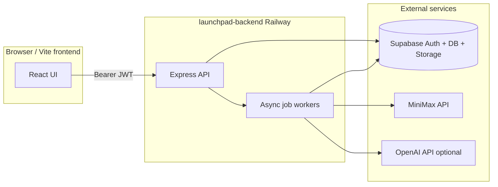

# Pitch Smasher — Project Documentation

**BuildATHON · Voice-first founder platform**

Pitch Smasher helps founders go from a spoken or typed idea to investor-ready materials and marketing assets. The product has two modes — **Pitch Mode** (guided founder journey) and **Campaign Mode** (product marketing kit) — backed by a Node.js API on Railway, Supabase for auth/storage, and AI providers (MiniMax, OpenAI) called only from the server.

---

## Table of contents

1. [Overview](#overview)
2. [Architecture](#architecture)
3. [What we use (and what we do not)](#what-we-use-and-what-we-do-not)
4. [Pitch Mode pipeline](#pitch-mode-pipeline)
5. [Campaign Mode pipeline](#campaign-mode-pipeline)
6. [API reference](#api-reference)
7. [Async jobs & polling](#async-jobs--polling)
8. [Data model](#data-model)
9. [Environment variables](#environment-variables)
10. [Local setup](#local-setup)
11. [Production & deploy](#production--deploy)
12. [Frontend integration](#frontend-integration)
13. [Repository layout](#repository-layout)

---

## Overview

| | |
|---|---|
| **Product** | Pitch Smasher |
| **Repo** | `Buildathon` — backend in `launchpad-backend/` |
| **API** | Express on Node 22+, deployed on Railway |
| **Auth & DB** | Supabase (email/password, Postgres, Storage) |
| **AI** | MiniMax (chat, search, music, images) + OpenAI (pitch JSON, TTS, banner prompts — recommended) |

### Pitch Mode

User describes an idea → backend structures it, researches the market, audits the concept, runs a 5-question founder interview, scores viability, then generates asynchronously:

- 10-slide pitch deck (JSON)
- Investor Q&A
- Marketing pack
- Per-slide images
- **PDF export** (Puppeteer + Chromium)
- Mixed **voiceover + background music** (TTS + MiniMax music + FFmpeg)

### Campaign Mode

User submits product description, tone, optional URL and reference photo → backend generates asynchronously:

- Ad script, taglines, captions, email copy, hero copy
- **Banner image** (MiniMax image-01, optional image-to-image from reference photo)
- **Mixed audio** (voiceover + music) — no video

---

## Architecture



**Principles**

- **Thin client** — never call MiniMax or OpenAI from the browser; use `VITE_API_URL` only.
- **Session-centric pitch flow** — one `sessionId` from capture through pitch; no `POST /api/sessions`.
- **Async heavy work** — `POST /api/pitch` and `POST /api/campaign` return `202` + `jobId`; poll `GET /api/jobs/:jobId` until `status: "done"`.
- **Singular routes** — `/api/session`, not `/api/sessions`.

---

## What we use (and what we do not)

### Used in production

| Capability | Provider | Where |
|------------|----------|--------|
| Idea capture & JSON parsing | MiniMax chat | `POST /api/capture` |
| Market scan (web search + merge) | MiniMax search + chat | `POST /api/scan` |
| Concept audit | MiniMax chat | `POST /api/audit` |
| Refine questions & profile | MiniMax chat + TTS | `POST /api/refine/*` |
| Viability score | MiniMax chat | `POST /api/validate` |
| Pitch deck, Q&A, marketing | OpenAI (default) or MiniMax | Pitch job |
| Slide images | MiniMax image-01 / Pollinations / OpenAI / placeholder | Pitch job |
| Pitch PDF | Puppeteer (local Chromium) | Pitch job + `GET .../export/pdf` |
| Pitch & refine TTS | OpenAI (default) or MiniMax | Jobs + refine |
| Background music | MiniMax `music-2.6` | Pitch & campaign jobs |
| Audio mixing | FFmpeg | Pitch & campaign jobs |
| Campaign copy | MiniMax chat | Campaign job |
| Campaign banner | MiniMax image-01 (+ optional reference image) | Campaign job |
| Auth, persistence, files | Supabase | All routes |

### Not used (intentionally removed)

| Feature | Notes |
|---------|--------|
| **MiniMax video generation** (`video-01`, `/v1/video_generation`) | Not part of the product. Campaign jobs do not call video APIs. `video_url` / `videoUrl` may appear as `null` in API responses for schema compatibility only. |
| **Video muxing** | `muxVideoAudio` is not used. |
| **`video` storage bucket** | Not required; use `audio`, `images`, `exports`. |
| **PPTX export** | Replaced by PDF. |
| **Direct browser → AI** | Keys stay on the server. |

---

## Pitch Mode pipeline

```txt
capture → scan → audit → refine (5 Q&A) → validate → pitch (async job)
```

| Step | Endpoint | Session `stage` after |
|------|----------|------------------------|
| 1. Capture idea | `POST /api/capture` `{ transcript }` | `captured` |
| 2. Market scan | `POST /api/scan` `{ sessionId }` | `scanned` (cached 24h) |
| 3. Audit | `POST /api/audit` `{ sessionId }` | `audited` |
| 4a. Start interview | `POST /api/refine/start` `{ sessionId }` | `refining` |
| 4b. Answer (×5) | `POST /api/refine/answer` `{ sessionId, questionIndex, answerTranscript }` | — |
| 4c. Compile profile | `POST /api/refine/complete` `{ sessionId }` | `refined` |
| 5. Viability | `POST /api/validate` `{ sessionId }` | `validated` |
| 6. Generate pitch | `POST /api/pitch` `{ sessionId }` → **202** + `jobId` | `pitched` when job completes |

**Capture body:** send one string `transcript` (merge voice + form fields on the client). Do not send `idea` as the field name.

**Refine:** five tailored questions from `concept_summary` (stored on session as `refine_questions`). Each question may include `audioUrl` (TTS). If generation fails, a fixed fallback list is used.

**Pitch job stages** (poll `GET /api/jobs/:jobId`):

1. `queued`
2. `generating_content` — deck, investor Q&A, marketing pack
3. `generating_slide_images`
4. `generating_pdf`
5. `tts` → `music` → `mixing` → `uploading`
6. `done`

**Pitch job result** (`job.result`):

- `pitchDeck`, `investorQA`, `marketingPack`
- `pdfUrl`, `pdfFilename`, `slideImageUrls`
- `audioUrl` (may be null if TTS/mix failed; check `audioWarning`)
- No video fields

**Exports**

- `GET /api/session/:id/export/pdf` — download or regenerate PDF (`?regenerate=1`, `?redirect=1`)
- `GET /api/session/:id/export/report` — JSON bundle of session data

---

## Campaign Mode pipeline

| Step | Endpoint | Notes |
|------|----------|--------|
| Create + enqueue | `POST /api/campaign` | **202** + `jobId` |

**Body (JSON or multipart):**

| Field | Required | Notes |
|-------|----------|--------|
| `description` | Yes | Product / campaign description |
| `tone` | Yes | `energetic` \| `professional` \| `emotional` \| `funny` |
| `productUrl` | No | Scraped for extra context |
| `referenceImage` | No | Multipart file (max 5MB, image/*) |
| `referenceImageUrl` | No | Public URL for image-to-image (`images` bucket must be public) |

**Campaign job stages:**

1. `queued`
2. `scraping_url` (if `productUrl` set)
3. `generating_copy`
4. `generating_banner`
5. `generating_voice` → `generating_music` → `mixing_audio`
6. `done`

**Campaign job result:**

- `adScript`, `taglines`, `captions`, `emailCopy`, `heroCopy`
- `bannerUrl`, `audioUrl`, `referenceImageUrl`
- `videoUrl` is always `null` (not generated)

**Download assets:** `GET /api/campaign/:id/download` (ZIP of banner + audio when available)

---

## API reference

Base URL: your Railway app or `http://localhost:3000`.  
Protected routes: `Authorization: Bearer <access_token>`.

### Public

| Method | Path | Description |
|--------|------|-------------|
| GET | `/health`, `/api/health` | Health + config flags |
| POST | `/api/auth/signup` | `{ email, password, name? }` |
| POST | `/api/auth/signin` | Returns `access_token` |

### Auth (protected)

| Method | Path | Description |
|--------|------|-------------|
| POST | `/api/auth/signout` | Logout |
| GET | `/api/auth/me` | Current user profile |

### Pitch pipeline (protected)

| Method | Path | Description |
|--------|------|-------------|
| POST | `/api/capture` | Create session from transcript |
| POST | `/api/scan` | Market research |
| POST | `/api/audit` | Concept audit |
| POST | `/api/refine/start` | Start 5-question interview |
| POST | `/api/refine/answer` | Submit answer, get next question |
| POST | `/api/refine/complete` | Build `ideaProfile` |
| POST | `/api/validate` | Viability score |
| POST | `/api/pitch` | Start pitch job → **202** |

### Jobs (protected)

| Method | Path | Description |
|--------|------|-------------|
| GET | `/api/jobs/:jobId` | Poll status; includes `progress`, `progressLabel`, `progressPercent`, `stages` |

Job terminal states: `done` or `failed` (not `completed`).

### Sessions & history (protected)

| Method | Path | Description |
|--------|------|-------------|
| GET | `/api/session` | List user's pitch sessions |
| GET | `/api/session/:id` | Full session row |
| DELETE | `/api/session/:id` | Delete one session + files |
| DELETE | `/api/session` | Delete all sessions for user |
| GET | `/api/session/:id/export/pdf` | PDF export |
| GET | `/api/session/:id/export/report` | JSON report download |
| GET | `/api/history` | `{ pitches, campaigns }` for History UI |

### Campaigns (protected)

| Method | Path | Description |
|--------|------|-------------|
| POST | `/api/campaign` | Create campaign → **202** |
| GET | `/api/campaign` | List campaigns |
| GET | `/api/campaign/:id` | Full campaign row |
| GET | `/api/campaign/:id/download` | ZIP download |
| DELETE | `/api/campaign/:id` | Delete campaign |
| DELETE | `/api/campaign` | Delete all campaigns |

### Common errors

| Status | `error` | Meaning |
|--------|---------|---------|
| 400 | `VALIDATION` | Missing/invalid body |
| 400 | `INVALID_STATE` | Wrong pipeline order (e.g. pitch before validate) |
| 401 | — | Missing or expired token |
| 403 | — | Not owner of session/campaign |
| 409 | `NOT_READY` | PDF requested before pitch job completes |
| 503 | `PDF_RENDERER_UNAVAILABLE` | Chromium failed on server |

---

## Async jobs & polling

```js
// After POST /api/pitch or POST /api/campaign (202)
const { jobId } = await res.json();

async function pollJob(jobId) {
  for (;;) {
    const job = await api(`/api/jobs/${jobId}`);
    if (job.status === 'done') return job.result;
    if (job.status === 'failed') throw new Error(job.error);
    await new Promise((r) => setTimeout(r, 2000));
  }
}
```

Use `job.progressLabel` and `job.progressPercent` for UI — not raw keys alone.

---

## Data model

Run [`launchpad-backend/supabase/schema.sql`](launchpad-backend/supabase/schema.sql) in Supabase. Existing projects: also run [`launchpad-backend/supabase/migrations/002_campaign_reference_image.sql`](launchpad-backend/supabase/migrations/002_campaign_reference_image.sql).

### `sessions` (pitch)

| Field | Purpose |
|-------|---------|
| `stage` | Pipeline stage (`captured` … `pitched`) |
| `idea_raw` | Original transcript |
| `concept_summary` | Structured idea JSON |
| `scan_result` | Market scan + citations |
| `audit_result` | Audit JSON |
| `refine_questions`, `refine_answers` | Interview |
| `idea_profile` | Compiled founder profile |
| `viability_score` | Validate output |
| `pitch_output` | Deck, Q&A, marketing, PDF URLs, slide images |
| `audio_url` | Mixed pitch narration MP3 |

### `campaigns`

| Field | Purpose |
|-------|---------|
| `description`, `tone`, `product_url` | Input |
| `reference_image_url` | Optional product photo for banner |
| `ad_script`, `taglines`, `captions`, `email_copy`, `hero_copy` | Generated copy |
| `banner_url`, `audio_url` | Generated assets |
| `video_url` | Legacy column; always unused (`null`) |
| `status` | `processing` \| `done` \| `failed` |

### `jobs`

Links `user_id` to `session_id` (pitch) or `campaign_id` (campaign); stores `status`, `progress`, `result`, `error`.

### Storage buckets (required)

| Bucket | Purpose |
|--------|---------|
| `audio` | TTS, mixed pitch/campaign audio |
| `images` | Campaign banners, reference photos, slide images |
| `exports` | Pitch deck PDFs |

Enable **public read** on `images` so MiniMax can fetch reference URLs for image-to-image.

---

## Environment variables

Copy [`launchpad-backend/.env.example`](launchpad-backend/.env.example).

| Variable | Description |
|----------|-------------|
| `SUPABASE_URL`, `SUPABASE_SERVICE_KEY`, `SUPABASE_ANON_KEY` | Required in production |
| `MINIMAX_API_KEY` | Token Plan key — chat, search, music, images |
| `MINIMAX_API_BASE` | Default `https://api.minimax.io` |
| `MINIMAX_GROUP_ID` | Optional; only some pay-as-you-go accounts |
| `OPENAI_API_KEY` | Pitch JSON, TTS, banner prompts (recommended) |
| `PITCH_LLM_PROVIDER` | `openai` (default if key set) or `minimax` |
| `TTS_PROVIDER` | `openai` (default if key set) or `minimax` |
| `IMAGE_PROVIDER` | `minimax`, `pollinations`, `openai`, or `placeholder` |
| `MOCK_AI` | `false` in production |
| `CORS_ORIGIN` | Comma-separated frontend origins |
| `DEV_BYPASS_AUTH` | `true` only for local dev |
| `USE_MEMORY_DB` | In-memory DB without Supabase |

See [`launchpad-backend/PRODUCTION.md`](launchpad-backend/PRODUCTION.md) for Railway checklist details.

---

## Local setup

```bash
cd launchpad-backend
cp .env.example .env
# Fill Supabase + MINIMAX_API_KEY (+ OPENAI_API_KEY recommended)
npm install
npm run dev
```

Health: `GET http://localhost:3000/health`

For pitch PDFs locally, Puppeteer uses bundled Chromium unless `PUPPETEER_EXECUTABLE_PATH` is set (Railway uses `nixpacks.toml`).

Optional: run flows from [`launchpad-backend/demo.http`](launchpad-backend/demo.http).

---

## Production & deploy

1. Supabase project + schema + buckets (`audio`, `images`, `exports`)
2. Railway project from `launchpad-backend` (FFmpeg via `nixpacks.toml`, Chromium for PDF)
3. Set env vars; `MOCK_AI=false`, `CORS_ORIGIN` includes your Vercel URL
4. Verify: `curl https://your-app.up.railway.app/health`

Short checklists: [`launchpad-backend/PRODUCTION.md`](launchpad-backend/PRODUCTION.md), [`launchpad-backend/DEPLOY.md`](launchpad-backend/DEPLOY.md).

---

## Frontend integration

**Frontend team:** see **[FRONTEND_TEAM_GUIDE.md](FRONTEND_TEAM_GUIDE.md)** for auth, pitch flow, job polling, and exports.

### Environment

```env
VITE_API_URL=https://your-api.up.railway.app
```

### Auth flow

```js
const { access_token } = await fetch(`${API}/api/auth/signin`, {
  method: 'POST',
  headers: { 'Content-Type': 'application/json' },
  body: JSON.stringify({ email, password }),
}).then((r) => r.json());

// All protected calls
headers: { Authorization: `Bearer ${access_token}`, 'Content-Type': 'application/json' }
```

### Suggested localStorage keys

- `Pitch Smash_token` — access token
- `Pitch Smash_sessionId` — current pitch session
- `Pitch Smash_jobId` — active async job

### Rules for UI builders

1. Never expose service keys in the frontend.
2. Use `transcript` on capture, not `idea`.
3. Poll jobs until `status === "done"`.
4. Handle `audioUrl: null` — still show text (refine questions, pitch warnings).
5. Do not build UI for promo video — it is not generated.
6. Do not use PDF export — removed. Use in-app deck UI and/or `GET /api/session/:id/export/pptx`.
7. On **401**, clear token and redirect to login.

### CORS

Backend merges `CORS_ORIGIN` with `http://localhost:5173`. If sign-in works in curl but fails in the browser, add your Vercel URL to `CORS_ORIGIN` on Railway.

---

## Repository layout

```txt
Buildathon/
├── PROJECT.md                 ← this file
└── launchpad-backend/
    ├── index.js               Express app & route mounting
    ├── routes/                HTTP handlers (auth, capture, scan, …)
    ├── services/              Jobs, AI, PDF, images, TTS, Supabase
    ├── prompts/               LLM system/user prompt builders
    ├── middleware/            Auth, rate limits, errors
    ├── supabase/              schema.sql + migrations
    ├── utils/                 Config, parsing, mocks
    ├── nixpacks.toml          Chromium + FFmpeg on Railway
    ├── README.md              Quick start pointer
    ├── PRODUCTION.md          Production env checklist
    └── DEPLOY.md              Deploy checklist
```

---

## Health check example

```json
{
  "ok": true,
  "mockAi": false,
  "supabase": true,
  "minimax": true,
  "openai": true,
  "webSearch": "minimax",
  "imageProvider": "minimax",
  "ttsProvider": "openai",
  "pitchLlmProvider": "openai"
}
```

---

*Last updated: May 2026 — PDF pitch export, no video generation.*
